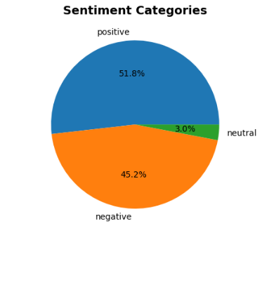

# Reddit’s Political Temper Check: A Computational Study of Sentiment, Topic Distribution, and Discourse Vocabulary Across Political Communities

## 1. Introduction

Internet-based discourse in general and political discussions in particular have expanded rapidly both in size and significance and now hold a greater sway in shaping the public's thoughts and opinions. Reddit, as one of the most popular discussion platforms, provides a unique window into how different political communities engage in discourse. Comprehending modern democratic dialogue relies on how well the characteristics of political communication across different ideological lines are understood and perceived.

To this end, we conducted a study to identify the main topics of discourse, sentiment, and to what extent evidence-based and discourse markers are prevalent in their political discussions. 

Specifically, we aimed to:

- Analyze sentiment patterns across different political categories
- Identify common topics in political discourse by unsupervised learning
- Measuring and comparing the prevalence of evidence-based vocabulary between different political subreddit categories.
- Examine any relationships between different variables (sentiment and linguistic features)

## 2. Methodology

### 2.1 Dataset

The analysis used the **corpus-webis-tldr-17.json** dataset. However, due to hardware constraints, only the first 300,000 were studied, which included Reddit comments across various subreddits. Filtering by the list of political subreddits, we came to the final dataset of 8,781 comments from politically oriented discussions.

### 2.2 Data Preprocessing

The data preprocessing consisted of several steps to prepare the data for the following steps. As the first step, unnecessary information such as URLs, Reddit mentions, and punctuation was removed. Leveraging WordNet’s lemmatizer, we reduced words to their base forms to ensure consistency and standardization. Additionally, we applied a minimum length requirement to only include meaningful text entries.

### 2.3. Topic Modeling

In an attempt to finding out what the main topic of discussion are, we performed a topic modelling. Before that, we needed to convert the textual data to vectors; this was accomplished by TF-IDF vectorization set to maximum of 1500 features and a minimum document frequency of 3 to trade-off computational efficiency and good representation of meaningful words, respectively. Although LDA was used to calculate perplexity scores as a supportive metric, we opted for NMF for finding the optimal number of topics (determined by cohesion score) and actual modeling due to potential better performance on shorter texts compared to LDA, and simplicity/computational efficiency compared to more advanced methods like BERTopic. 

### 2.4 Political Categorization

Taking insight from the topics discovered by topic modeling, we defined the following categories, and assigned one of these categories to each entry in the dataset based on its subreddit.

- **Left**
- **Right**
- **Center**
- **Geopolitics**
- **Job and Finance**
- **Law and Crime**
- **Election**
- **Other**

Note that even though topic analysis was based on content text, we classified entries in these categories based on their subreddit and not their text content. This is because we were interested in studying sentiment and language in different categories of political subreddits, not different categories of political content across all subreddits. We took this indirect approach as it was almost impossible to directly cluster and label subreddits based on their names effectively due to their short and often seemingly meaningless names. Essentially, not only did topic modelling help us with our goal of finding the main topic of discussion, but it also helped to classify over 600 subreddits into a few main categories.

### 2.5. Sentiment Analysis

We employed VADER (Valence Aware Dictionary and sEntiment Reasoner) to compute sentiment scores, which produced compound scores ranging from -1 (most negative) to +1 (most positive). VADER is a very popular lexicon- and rule-based sentiment analyzer. We favored this tool in spite of the advent of more recent and powerful transformer-based models, as VADER was specifically designed and tuned for analyzing sentiment in social media text, with the bonus of being much faster and much less hardware-demanding.

### 2.6. Discourse and Evidence-based Vocabulary Measurement

A comprehensive keyword analysis was conducted using 197 keywords across eight categories:

- Evidence & Empirical Grounding (25 keywords)
    - 'evidence', 'data', 'statistics’, etc.
- Logical Structure & Reasoning (32 keywords)
    - 'therefore', however', 'although’, etc.
- Analytical & Critical Thinking (28 keywords)
    - 'evaluate’, 'contrast’, etc.
- Policy & Governance Focus (35 keywords)
    - 'policy’, ‘reform’, etc.
- Deliberative Quality & Nuance (24 keywords)
    - 'perhaps', 'possibly’, etc.
- Stakeholder & Perspective Awareness (20 keywords)
    - 'perspective', 'viewpoint’, etc.
- Temporal & Contextual Awareness (18 keywords)
    - 'current', 'recent’, etc.
- Constructive Engagement (15 keywords)
    - 'together’, ‘solution’, etc.

We measured both the **average** and **density** of using these **keywords** in the text of comments in each category.

## 3. Results

### 3.1 Sentiment Analysis Findings

### 3.1.1 Overall Sentiment Distribution

- **Positive**: 4,549 comments (51.8%)
- **Negative**: 3,970 comments (45.2%)
- **Neutral**: 262 comments (3.0%)

### 3.1.2 Sentiment by Political Category

Significant differences in sentiment were observed across political categories:

| Political Category | Mean Sentiment | Standard Deviation | Sample Size |
| --- | --- | --- | --- |
| Job and Finance | 0.1968 | 0.7293 | 454 |
| Election | 0.1610 | 0.7178 | 107 |
| Center | 0.1485 | 0.8368 | 107 |
| Law and Crime | 0.1099 | 0.7879 | 107 |
| Other | 0.0864 | 0.7802 | 714 |
| Geopolitics | 0.0488 | 0.7791 | 469 |
| Right | 0.0411 | 0.7912 | 961 |
| Left | 0.0322 | 0.7648 | 5,862 |

We also performed ANOVA results which confirmed statistically significant differences (F=3.7196, p=0.0005).

### 3.2 Topic Analysis

Eight distinct topics were identified through NMF modeling:

1. **Topic 0**: General Discussion - people, way, time, point, really, woman
2. **Topic 1**: Economic Policy - government, money, company, market, bank, cost
3. **Topic 2**: Electoral Politics - party, vote, republican, democrat, obama, election
4. **Topic 3**: Legal/Constitutional - state, law, government, right, court, united
5. **Topic 4**: Taxation - tax, income, pay, rate, income tax, tax rate
6. **Topic 5**: Education - school, student, education, year, college, kid
7. **Topic 6**: Gun Policy - gun, firearm, crime, weapon, violence, shooting
8. **Topic 7**: Labor Issues - job, wage, work, minimum, worker, minimum wage

### 3.3 Discourse Quality Metrics

### 3.3.1 Descriptive Statistics

- **Average Content Length**: 1,263 characters (SD = 1,178)
- **Average Word Count**: 217 words (SD = 202)
- **Average Keyword Count**: 7.6 keywords (SD = 6.0)
- **Average Keyword Density**: 0.040 (SD = 0.025)

### 3.3.2 Discourse Vocab. by Political Category

| Political Category | Avg Content Length | Avg Word Count | Avg Keyword Count | Keyword Density |
| --- | --- | --- | --- | --- |
| Center | 1,683 | 285 | 10.98 | 0.0428 |
| Law and Crime | 1,482 | 258 | 9.09 | 0.0425 |
| Other | 1,456 | 251 | 8.28 | 0.0387 |
| Right | 1,325 | 227 | 7.94 | 0.0405 |
| Job and Finance | 1,317 | 225 | 7.92 | 0.0407 |
| Geopolitics | 1,281 | 219 | 7.63 | 0.0398 |
| Left | 1,217 | 210 | 7.33 | 0.0400 |
| Election | 1,014 | 178 | 6.08 | 0.0371 |

### 3.4 Correlation Analysis

**Notable correlations:**

- **Keyword density vs Content Length**
    - Significant negative
    
    
    

*These do not indicate any causality.*

- **Sentiment vs Keyword Density**
    - No significant correlation
    
    
    

## 4. Discussion

### 4.1 Sentiment Patterns

The analysis reveals that discussions in **Job and Finance-, election-, and center-**related subreddits exhibit the most positive sentiment, while **Left and right** related subreddits show the lowest average sentiment in their communities. This may stem from the idea that economic discussions may be more solution-oriented, while ideological discussions may be more critical or negative in tone.

### 4.2 Topic Distribution

The identification of eight distinct topics demonstrates the span of political discourse on Reddit: from specific policy areas (taxation, gun policy, education) to broader institutional discussions (legal/constitutional, electoral politics). The prominence of economic and labor-related topics reflects their central role in contemporary online political discourse.

### 4.3 Discourse Quality Variations

**Center** and **Law** and **Crime** categories demonstrate highest discourse vocabulary metrics, with longer content and higher keyword density. This suggests these discussions typically require more nuanced analysis (centrist positions, legal matters) and may naturally employ more sophisticated discourse patterns. Interestingly, while discussions in election related subreddits have the highest sentiment (more positive in tone), they rank lowest in use of evidence-based vocabulary. Moreover, the lack of a significant correlation between keyword density and sentiment indicates that criticizing remarks on Reddit do not use more evidence-based vocabulary.

## 5. Limitations

### 5.1 Dataset Limitations

- **Sample Size Imbalance**: Left-oriented comments are more well represented in the dataset, despite using imbalance insensitive measurements.
- **Temporal Scope**: Analysis represents a snapshot in time and may not capture continuous discourse patterns
- **Sentiment Analysis**: VADER may not capture context-specific sarcastic discussions well compared to transformer-based methods.
- **Content Classification**: Comments may contain multiple political themes not captured by single-category assignment, in which case we chose the more specific category.

## 6. Conclusions

This computational analysis provides empirical evidence for systematic differences in political discourse across ideological orientations on Reddit.

Key findings:

1. **Significant sentiment variations** across political categories, with economic discussions showing more positive sentiment
2. **Eight distinct topic clusters** representing core areas of political discourse
3. **Measurable discourse quality differences**, with centrist and legal discussions exhibiting higher complexity metrics
4. **Positive correlations** between content length, keyword usage, and sentiment

This study revealed how political affiliation influences communication patterns in online environments, providing important considerations for research into the quality of civic discourse and ideological polarization phenomena. We also release the resulted dataset with added dimensions for other researchers to build on.

**This report is still in development!**